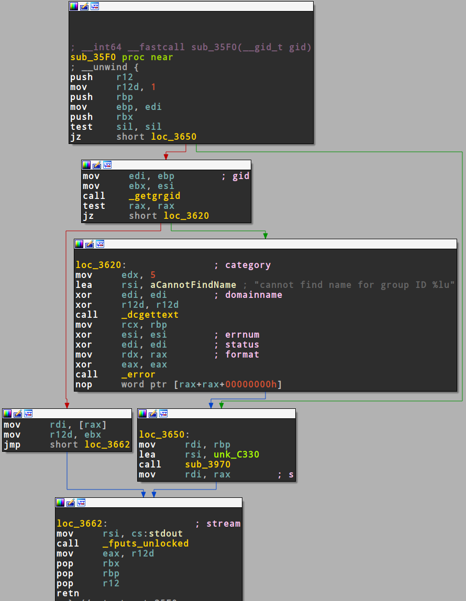
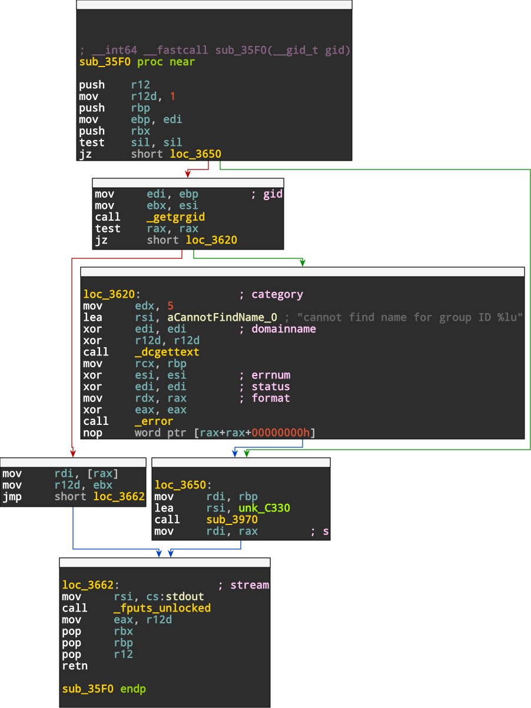

# IDA Graph Exporter

## What?

Plugin for IDA Pro that allows to export a function as rendered in the graph view to a vectorized SVG. The native plugin retrieves all relevant information from the currently focused graph view and stores them into a JSON. The JSON is then to be processed `json2svg.py` to produce an SVG. Compiled versions of the plugin for IDA Versions 7.0 to 8.2 can be found on the [Release page](https://github.com/kirschju/ida-graph-exporter/releases).

The native code ships (amalgamated) copies of [miniz 3.0.2](https://github.com/richgel999/miniz) and [jsoncpp 1.9.5](https://github.com/open-source-parsers/jsoncpp) for compression and JSON serialization. The python script converting JSON to SVG needs [svgwrite](https://pypi.org/project/svgwrite/) installed.

## How?

1. Compile the source in this repository (you need the Hex-Rays SDK to do that) or download a precompiled plugin matching (closely) your IDA Pro version from the
[Release page](https://github.com/kirschju/ida-graph-exporter/releases).
2. Copy both `IdaGraph.dll` and `IdaGraph64.dll` into the `plugins` directory of your local IDA Pro installation and reload IDA.
3. Open the control flow graph that is to be exported in a graph viewer tab and export it to JSON via `Edit -> Plugins -> Graph Exporter`.
4. Convert the JSON to SVG using `json2svg.py <output.json>`. The output file name is the same as the input plus an `.svg` suffix.
5. Optional: To convert the SVG to PDF, I use `rsvg-convert -f pdf -o <output.pdf> <input.svg>`

## Example

Screenshot of some function taken from an `/usr/bin/id` binary:



Exported SVG:



Converting from SVG to [PDF](example/id.json.pdf):

```bash
rsvg-convert -f pdf -o id.json.pdf id.json.pdf.svg
```
